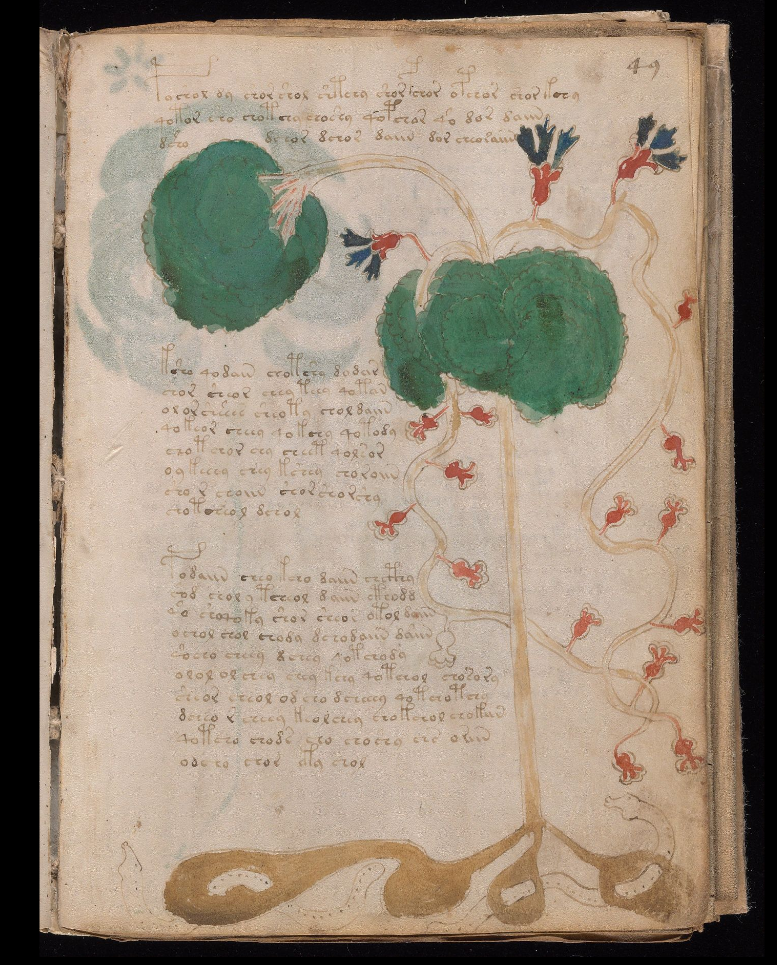
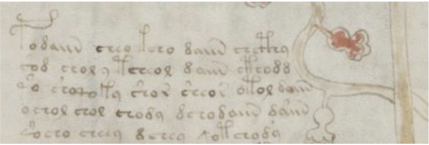
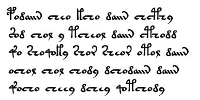

# voyniXfiles
Cracking Voynich's manuscript

## Cracking Voynich's Manuscript: An datascience and profiling analysis
Voynich's manuscript is a mysterious illustrated book, written in unknown script in an unknown language. According to radiocarbon dating (C14), used inks, pergament are dated between 1404 and 1438. The book is named after Wilfrid Michael Voynich who acquired the manuscript in Italy in 1912. The text is currently owned by Yale University under the name MS 408. 

The manuscript is of interest to many scientists of various disciplines, especially cryptologists.
Purpose of this project is show indications of possible linguistic relationships between the Voynich and other languages and propose hypothesis, assumption supported with historical context of origin of this manuscript. 

The book probably had about 272 pages in 17 sheets, but only 240 have survived. The text is written on parchment in unknown script and unknown language, except some small Latin notes text on margin fo pages . The whole book has about 35,000 words, while the individual characters do not follow each other randomly, but certain laws can be traced in them, which testifies to the existence of spelling and grammar rules. Statistical analysis of the text suggests that [Zipf's law](https://www.eleceng.adelaide.edu.au/personal/dabbott/wiki/index.php/Semester_B_Final_Report_2014_-_Cracking_the_Voynich_code#Zipf.27s_Law) applies to the language used, the average length of each word is roughly the same as Latin or English.  According to the illustrations, the book is divided into several parts, it is likely that it is a treatise or treatises from several areas:
- Botanical part. The illustrations contain pictures of plants, most of them are difficult to identify, some have not been identified to date.
- Astronomical part. Illustrations include astronomical diagrams, astrological diagrams and symbols, zodiac sketches. Some diagrams are followed by the names of the months of the year in Latin, in the Romance language, perhaps in Catalan or Occitan. However, it is possible that the passages written in Latin were added later.
- Biological part. The illustrations mostly show miniatures of naked women bathing in some strange formations, some of which resemble bodily organs. Some of the women have crowns.
- Cosmological part. The illustrations remotely resemble maps of a strange landscape or cosmological sketches. Castles, perhaps volcanoes, are shown.
- Pharmacological part. Illustrations show parts of plants (roots, leaves). Perhaps these are pharmaceutical prescriptions, which may be indicated by the fact that the text is divided into short paragraphs in this section.
- Recipes. Without illustrations, the text is divided into short paragraphs, separated by bullets in the shape of a flower or star.

### A Voynich manuscript journey through the centuries

The first documented owner was the alchemist Georgius Barschius, who lived in Prague and lived in the early 17th century. But this alchemist obviously didn't know how to decipher the book, because he said it "only uselessly took up space in the library." After his death in 1662, the manuscript was obtained by the physician and rector of Charles University, the scholar Jan Marcus Marci, who sent the book to the learned Jesuit Athanasius Kircher. The manuscript was stored in the library of the Pontifical University of Gregorian.
For the next 200 years, there are no records of the book, but it bears ex libris the Jesuit scholar Peter Jan Beckx (1795-1887), among others the rector of the university, which may indicate that the book has moved to his private library, from which it was in 1866 he bought the Jesuit order.

The book re-emerged in 1912, when Wilfrid Voynich found it in a Jesuit library in Italy. 
In the book he found a letter from 1665, written by mentioned Prague scholar Johannes Marcus Marci, who sent it together with the book to Rome to his friend Athanasius Kircher. According to the letter, the manuscript previously belonged to Emperor Rudolf II, who was to pay 600 ducats for it. It is not at all clear to whom it belonged before. All we know is that the ink dates from the first half of the 15th century, so it could have been created more than 100 years before the Roman emperor bought it.

Wilfrid Voynich thought that the book could have been sold to the emperor by the Englishman John Dee. We do not know exactly where the manuscript originated and who created it.

## Occam's razor principle (or follow the money principle) in assumption about author and language of Voynich's manuscript
By mentioned letter, Emperor Rudolf II paid 600 gold ducats, approximatelly million dolars in today price (600 x troy ounce of gold, 31 g = cca 1,86 kg gold) for this manuscript.
Rudolf II was well known for his ability spent lot of money to buy art, alchemistic, occult artefacts.
An this was a great opportunity for speculative business for experienced alchemists, occultists like John Dee, or Edward Kelly, both acting on court of Emperor Rudolf II.

They can not resist to attempt to prepare and sell to Emperor the mysterious book with old unknown script and language.
John Dee has Welsh origin and probably knows old Celtic language like for example Welsh language.
To create book is than enough exchange latin script with some new one, simple replace latin character with some nice new type , which looks ancientaly and write botanical, astronomical or other normal text in Welsh language with new mysterious alphabet. After put illustration. If they did one page per day, whole book took 270 days, 9 months of work, but probably less somewhen around years 1583-1584. 

They needs just procure old pergament and inks to imitate old book in their times. This fit with known fact, that used inks, pergament are dated between 1404 and 1438 at in principle not exclude John Dee and Edward Kellye from this activity to cheat emperor with more sophisticated fake book containing some text from textbooks, or medieval literature transcripted to Voynich script and Welsh dialect may be combined with some stemmed medieval english words.

***{Edward Kelley (August 1, 1555, Worcester, England - November 1, 1597, Most, Bohemia)}*** also known as Edward Talbot or Edward Kelly was an English alchemist living and working much of his life at the court of Emperor Rudolf II. in Prague.
  In 1573 he enrolled at Oxford University. He did not complete his studies, but he liked to boast of his education and unjustifiably used his university degrees. He then studied pharmacist with Anthony Gray; this pharmacy knowledge helped him in his later alchemical work. He also worked in a law firm, where he committed fraud, for which he was punished - both ears were cut off.
In 1582, under the name Talbot, he entered the service of the famous scholar, naturalist, geographer, but also the famous astrologer, alchemist, magician and mystic John Dee. Kelley claimed to be talking to angels at the time, and Dee believed him and made him his companion and medium for his sessions. In February 1584, Dee traveled with his entire family and also with his assistant Kelley to Poland, where they stayed on the estate of Albert Lasky in Lask. After a month of their stay, they went to Krakow and then to Prague, where they arrived on August 9, 1584. Here they were welcomed by the famous naturalist and the emperor's personal physician Tadeáš Hájek from Hájek, who accommodated them in his house. At his intercession, they also received an audience with Emperor Rudolf II.
Some historians believe that John Dee and Edward Kelley were in fact secret agents of Queen Elizabeth I of England and were tasked with interfering in the favor of Rudolf II, who was known for his weakness for alchemy and magic.
 

***{John Dee (July 13, 1527 London, England - 1609 Mortlake, England)}***
was a mathematician, astronomer, alchemist, astrologer and occultist of Welsh descent. His surname "Dee" reflects the Welsh du (black).
Born in 1527 in London to the family of a rich businessman. He studied mathematics and astronomy on the Paris and Cambridge universities, then extensively travelled, acquainting himself with alchemy and magic on his trips around Europe. He served as the astronomer and mathematician at the court of the English Queen Elizabeth who in 1583 entrusted him with a secret diplomatic mission at the emperor Rudolf II's court in Prague. Later becoming the court alchemist of Emperor Rudolf II, to whom he dedicated a miraculous mirror. Dee came to Prague with Edward Kelley. After losing favour in Prague, he came to the service of Wilhelm von Rosenberg. He lived most of his time at Třeboň castle, until in 1589 he left the service of Wilhelm and returned back to England. 

***{Kelly's and Dee's Enochian language}***
 Kelly and Dee developed language system to "talk" with angels, this means to increase their mystic reputation they fabricate alphabet with structure similar to English, so called Enochian script. Due to is quite good assumption that they developed also Voynich script.

Follow this hypothesis, suppose as origin language some medieval age version, dialect of welsh language.
Let's look in this for example page, folio 49, botanical section, from introduction picture.

This after transcript from voynich manuscript dataset, see below:
- f49r.P.12;H;      podaiin.cheo.kcho.daiin.chcthy-
- f49r.P.13;H;      sod.chol.y.tcheol.daiin.cthodd-
- f49r.P.14;H;      qo.shoqoky.shor.sheor.otol.daiin-
- f49r.P.15;H;      ochol.chol.chody.dchodaiin.daiin-
- f49r.P.16;H;      qocho.cheey.dchey.qotchody-

Let's try translate first word "podaiin" using simple Googla translator from Welsch to English
"podaiin" has not translation, but small change in transcription from "podaiin" to "podainn" has translation from Welsch to English as "pods" which give a sense in botanical context as well as context of picture, where we can see a plant with pods or flowers. Similar first word os second row "sod" in English "sod" also.

| Voynix      | Welsch | English          |
| :---        |    :----:   |          ---: |
| podaiin      | podainn       | pods   |
| cheo   | cheo        | mist      |
| kcho   | cho        | as      |
| kcho   | chof       | memory |
| chcthy | chwthy     | as well |
| daiin  | daiinn      | goodness  |
| daiin  | dainn       | we dance  |
| sod    | sod         | sod       |
| chol   | chol        | dove      |
| y | y      | the |
| y | y      | per |
| tcheol | tcheol      | music |
| cthodd | cthodd      | got up |

After such combination of possible words translation with botanical context, first two sentences can be translated as:
- podaiin.cheo.kcho.daiin.chcthy -> pods mist goodness as well as 
- sod.chol.y.tcheol.daiin.cthodd -> sod as dove's music to dance got up 

** In Slovak ("struky zahalia blaženosťou ako aj podzemok ako holubia muzika do tanca povznáša, tak kratky strih zabrani blazenosti") **

That means, text describe some euphorical, narcotical effects parts of illustrated plant.

Looks promising, let's continue.

"qo.shoqoky.shor.sheor.otol.daiin", with first short word "qo" is no equivalent word in translation, but small transcription change q->g give "go"->"that".
Similar situation is with word otol, where "o"->"a" brings "atal"->"prevent" and word prevent in context of some herbal effects give a sense.
Let's do another translation table.

| Voynix      | Welsch | English          |
| :---        |    :----:   |          ---: |
| qo          | go          | that |
| shoqoky     | shagy       | shaggy |
| otol        | atal        | prevent |
| shor        | shor        | shor |
| sheor       | sheor       | George |
| sheor       | shear       | shear  |
| ochol      | ochol       | lateral   |
| chol   | chol        | dove      |
| chody      | chady      | yes |
| dchodaiin   | dchodaiinn        | we could      |
| dchodaiin   | dchodainn        | we can      |
| dchodaiin   | dchodain       | thirty |
| qocho | gach     | each |
| cheey  | daiinn      | goodness  |
| dchey  | dainn       | we dance  |
| qotchody   | sod         | sod       |

After such combination of possible words translation with botanical context, first two sentences can be translated as:
- podaiin.cheo.kcho.daiin.chcthy -> pods mist goodness as well as
- sod.chol.y.tcheol.daiin.cthodd -> sod as dove's music to dance got up

***In Slovak ("struky zahalia eufóriou/dobrotou ako aj drn/podzemok ako mierumilovna muzika do tanca povznáša")***

That means, text describe some euphorical stimulant effects from parts of illustrated plant.
Cracking of manuscript looks promising, let's continue.

"qo.shoqoky.shor.sheor.otol.daiin", with first short word qo is no equivalent Welsh word in translation, but small transcription change q->g give "go"->"that".
Similar situation is with word otol, where "o"->"a" brings "atal"->"prevent" and word prevent in context of some herbal effects give a sense. Such transcription change can have relation with unclear prononciation or some mix with dialect of medieval welsh and may be mixture with english stemming
Let's do another translation table. Remember "y" can be just grammatical article

| Voynich     | Welsch (Eng)| English          |
| :---        |    :----:   |          ---: |
| qo          | go          | that |
| shoqoky     | shagy       | shaggy |
| shor        | shor        | short |
| sheor       | shear       | shear  |
| otol        | atal        | prevent |
| ochol      | ochol       | lateral   |
| chol   | chol        | dove , peacefull, soft, moderate     |
| chody      | chady      | yes |
| chody      | chaed      | he did |
| dchodaiin   | dchodaiinn        | we could      |
| dchodaiin   | dchodainn        | we can      |
| dchodaiin   | dchodain       | thirty |
| qocho | gach     | each |
| cheey  | chwee      | sixe |
| dchey  | dchwe       | said  |
| qotchody   | gotch         | gotch       |

- qo.shoqoky.shor.sheor.otol.daiin -> that shaggy short (of sod) shear prevent goodness
- ochol.chol.chody.dchodaiin.daiin -> lateral soft did could goodness
- qocho.cheey.dchey.qotchody -> each sixe said gotch

**In Slovak ("tak krátky zostrih/rez (drnu/podzemku) zabráni blaženosti, mal by spôsobiť mierne vedľajšiu blaženosť, každý šiesty povedal, že dostal ")**

This give a botanical sense. Let's put it together

- podaiin.cheo.kcho.daiin.chcthy -> pods mist goodness as well as
- sod.chol.y.tcheol.daiin.cthodd -> sod dove's music to dance got up
- qo.shoqoky.shor.sheor.otol.daiin -> that shaggy short (of sod) shear prevent goodness
- ochol.chol.chody.dchodaiin.daiin -> lateral soft did could goodness
- qocho.cheey.dchey.qotchody -> each sixe said gotch

**In Slovak translation after some corrections giving more sense**

( struky zahalia eufóriou/dobrotou ako aj
drn/podzemok ako mierumilovná muzika do tanca povznáša
tak krátky zostrih/orez (drnu/podzemku) zabráni blaženosti
mal by spôsobiť len mierne podružnú blaženosť
každý šiesty povedal, že ju dostal (blaženosť))

